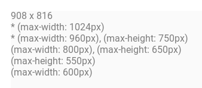

# mediaQueryAnalyzer
Usage: 

Start the bookmarklet and all media queries on the current page are displayed. The first line shows the current resolution. Active media queries are prefixed with a *. Everything gets updated in realtime when you resize the window.

Screenshot:

This overlay will appear in the upper left corner of the page and update while you resize the window.
